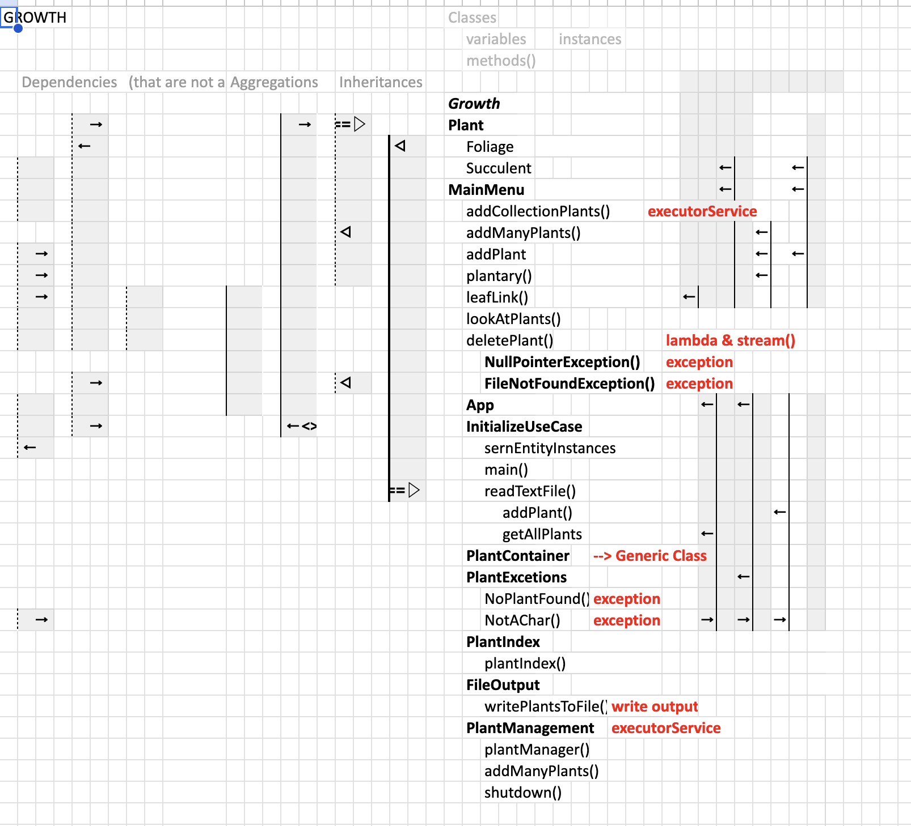
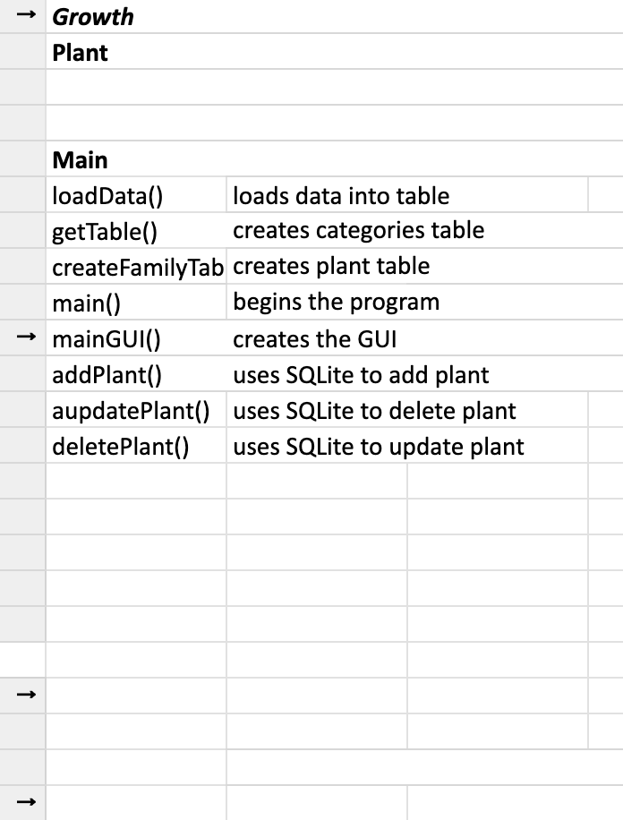

# GROWTH - GreenHouse Management System

## Introduction

GROWTH (GreenHouse Management System) is a Java project developed for my Java class. It is a comprehensive system designed to help users manage their virtual greenhouse by keeping track of different types of plants such as succulents and foliage. The project incorporates various concepts and features to provide an efficient and user-friendly experience.

## User Story

---

> Doug is an avid lover of plants. Although, it is hard to keep track of all the plants that he owns and their individual needs. While being able to add a new plant to your greenhouse, Doug can use our comprehensive system for managing and caring for various house plants. In GROWTH, users will be able to add and remove plants, update plant notes, view plant details, and receive care instructions to how to care for a specific plant. This project will showcase the practical functionality for plants enthusiasts

## Concepts and Features

- **Object-Oriented Programming (OOP):** This project is built using object-oriented principles, with plant types represented as classes and instances of those classes used to create and manage plants in the greenhouse.

- **Inheritance and Polymorphism:** This project utilizes inheritance to create different types of plants (succulents and foliage) that inherit common attributes and behaviors from a base `Plant` class. Polymorphism is employed to treat different plant types as instances of the base class, allowing for generic plant management operations.

- **Collections:** Java collections (such as `ArrayList`, `Array`) are employed to store and manage collections of plants. This enables efficient storage, retrieval, and manipulation of plant data.

- **Exception Handling:** GROWTH incorporates exception handling to gracefully handle errors and unexpected situations. Custom exception classes, such as `NoPlantFound` and `NotAChar`, are used to provide specific error messages and guide the user in resolving issues.

- **File Handling:** GROWTH includes file handling operations to read plant data from an external file. PlantDictionary.txt is parsed to extract relevant information, such as plant names, which are then presented to the user for selection during the plant addition process.

- **Concurrency** By incorporating these concurrency concepts and techniques, the project ensures efficient and concurrent execution of tasks, enhances performance, and provides a responsive user experience in a concurrent environment.

- **SQLite**  SQLite provides features to enforce data integrity constraints, such as unique values, foreign key relationships, and data types. The project utilizes SQL queries to create tables, insert, update, and retrieve data from the SQLite database. GROWTHSQLite leverages these capabilities to maintain the integrity and consistency of the stored data, ensuring that the greenhouse information remains accurate and reliable.

- **GUI** GROWTHSQLite incorporates a GUI to provide a user-friendly and interactive interface for managing the greenhouse and plants by using event-driven programming, where user actions or events trigger corresponding actions or responses in the application. The GUI allows users to perform various operations, such as adding, updating, and deleting plants. The project utilizes GUI libraries Swing, to handle user interactions, and update the table based on user input or system events.

## Usage

To use GROWTH, follow these steps:

1. Clone the repository or download the source code to your local machine.

2. Make sure you have Java installed on your system.

3. Compile the Java files using the following command:

   ```shell
   javac Main.java

4. Run the program using the following command:
    ``` java Main

5. Follow the on-screen instructions to interact with GROWTH. You can add plants, view plant lists, access additional plant information, and more.

## Technologies Used

Java: The project is implemented using the Java programming language.
Credits
This project was created for my Java class and is a result of my learning and practice in Java programming.

## Class Model & Sequence Diagram





## License

MIT License

Feel free to use, modify, and distribute this project in accordance with the terms of the MIT License.

## Appendix
Camilleri, L., & Kaplin, S. (2020). Plantopedia. Smith Streets Book.

ChatGPT, personal communication, February 11, 2023